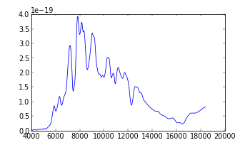
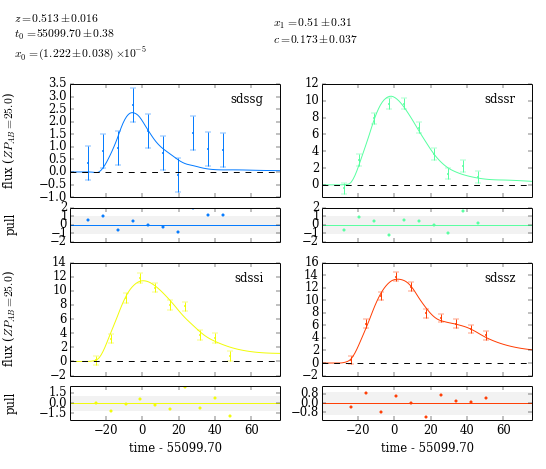

.. raw:: html

    

*******
SNCosmo
*******

SNCosmo aims to make high-level supernova cosmology analysis as easy
as possible, while still being completely extensible. It is built on
NumPy, SciPy and AstroPy.

.. raw:: html

    

        

            

**Simulation & synthetic photometry**

::

    >>> import sncosmo
    >>> model = sncosmo.get_model('salt2')
    >>> model.set(c=0.05, x1=0.5, mabs=-19.3, z=1.0, t0=55100.)
    >>> model.bandmag('sdssr', 'ab', times=[55075., 55100., 55140.])
    array([ 27.1180182 ,  25.68243714,  28.28456537])

*See more in* :doc:`models` *and* :doc:`builtins/models`

**Model spectra**

::

    >>> from matplotlib import plot as plt
    >>> wl, flux = model.disp(), model.flux(time=55110.)
    >>> plt.plot(wl, flux)

*See more in* :doc:`models`

**Read and Write Photometric Data**

::

   >>> meta, data = sncosmo.read_lc('mydata.dat', fmt='csv')
   >>> sncosmo.write_lc(data, 'mydata.json', meta=meta, fmt='json')
   >>> sncosmo.write_lc(data, 'mydata.dat', meta=meta, fmt='salt2')
   >>> sncosmo.write_lc(data, 'mydata.fits', meta=meta, fmt='fits')

*See more in* :doc:`photometric_data`

.. raw:: html

    

**Fitting Light Curves**

::

    >>> res = sncosmo.fit_lc(data, model, ['x1','c','z','mabs','t0'],
    ...                      bounds={'z': (0.3, 0.7)})
    >>> res.params['x1'], res.errors['x1']
    (0.14702167554607398, 0.033596743599762925)

*See more in* :doc:`fitting`

**Quick plots**

::

    >>> model.set(**res.params)  # set parameters to best-fit values
    >>> sncosmo.plot_lc(data, model)

*See more under "Plotting"* in the :doc:`reference`

**Photometric Typing**

::

    >>> typer = sncosmo.PhotoTyper()
    >>> sn1a_parlims = {'z': (0.01, 1.2), 'c':(-0.4, 0.6), 's': (0.7, 1.3),
    ...                 'mabs':(-18., -20.)}
    >>> sncc_parlims = {'z': (0.01, 1.1), 'c':(0., 0.6), 'mabs':(-17., -19.)}
    >>> typer.add_model('hsiao', 'SN Ia', sn1a_parlims)
    >>> typer.add_model('s11-2004hx', 'SN IIL', sncc_parlims)
    >>> types, models = typer.classify(data)
    >>> types['SN Ia']['p']
    1.0
    >>> models['hsiao']['p'], models['hsiao']['perr']
    (1.0, 0.0)

*See more in* :doc:`typing`

.. raw:: html

    

Development
-----------

This package is being actively developed. Bug reports, comments, and
help with development are very welcome.  Source code and issue
tracking is hosted on github: https://github.com/sncosmo

.. toctree::
   :hidden:
   :maxdepth: 1

   overview
   install
   models
   bandpasses
   magsystems
   photometric_data
   fitting
   typing
   registry
   reference
